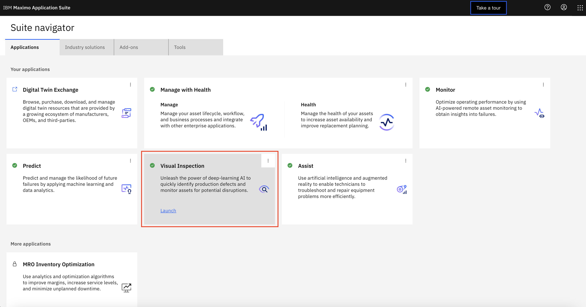
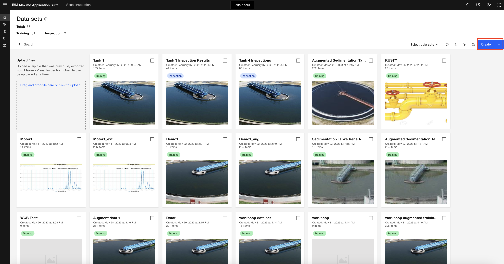
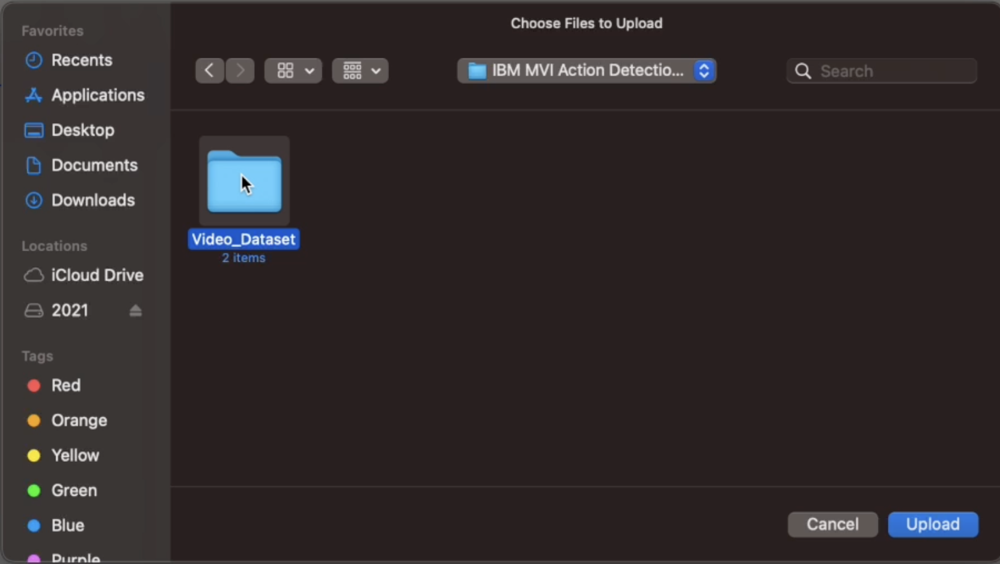
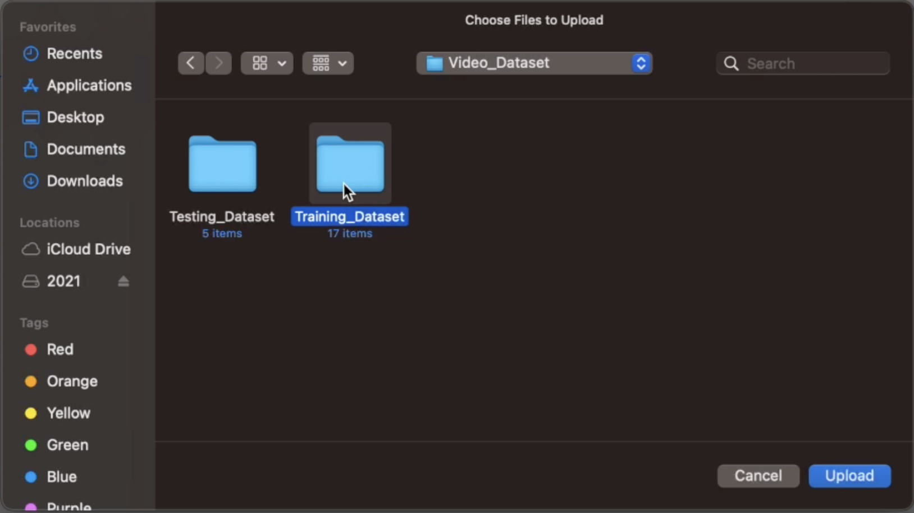
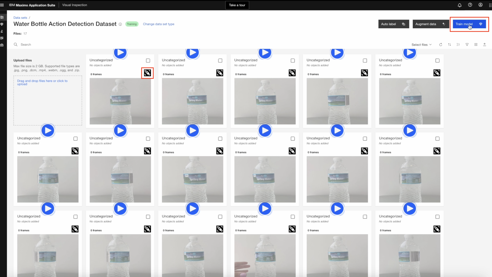
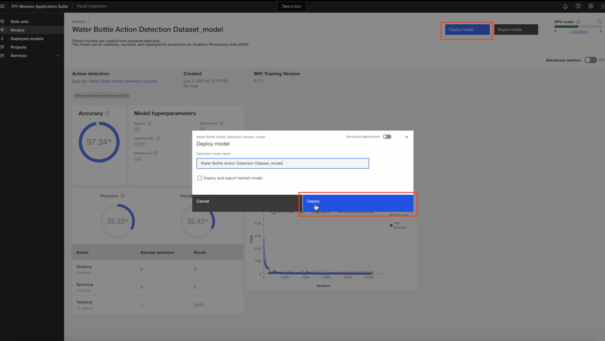
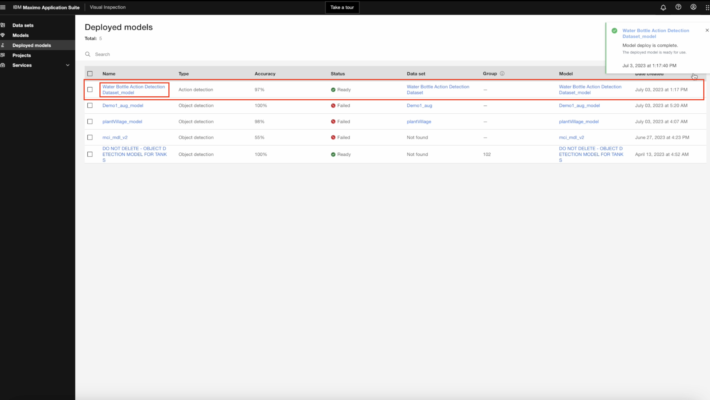
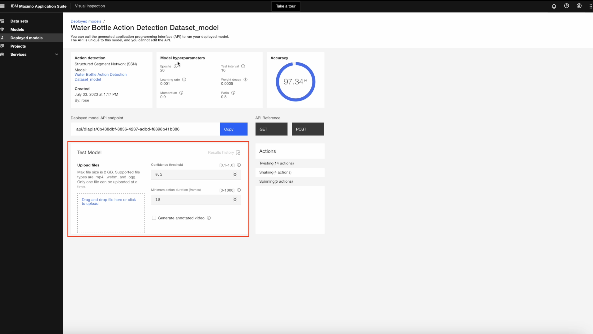
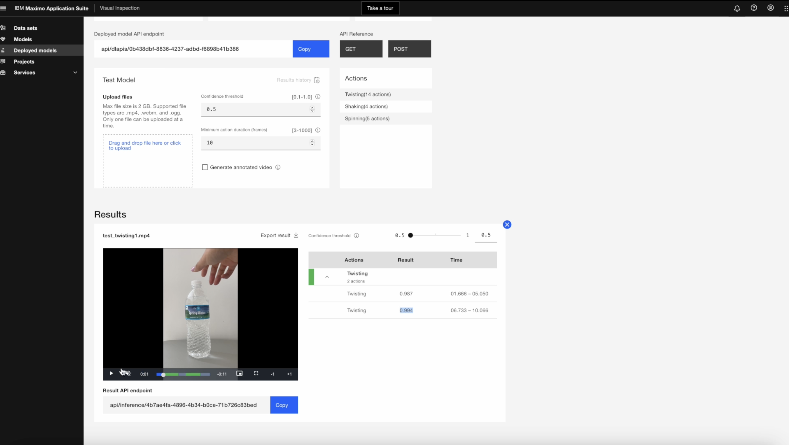
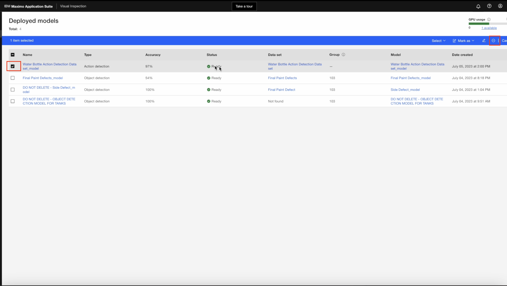

# Maximo Visual Inspection (MVI) - Action Detection

In this lab you will see MVI's Action Detection Functionality through creating, training and deploying your own video data set and action detection model using an MVI instance.

Make sure you have access to a Maximo environment; you can reserve one on TechZone [**here**](https://techzone.ibm.com/my/reservations/create/635952829aaefe0019bea350).

## MVI Action Detection

## Creating and labeling a data set

### Setup/Prerequisites: Creating or downloading a dataset of videos

The instructions below are for creating your own dataset of videos. Alternatively, this [**link**](_attatchments/mvi-action/Dataset) will also bring you to an already created set of videos ready to be used and uploaded to the Maximo Visual Inspection application. 

**Actions:**

1. Find a water bottle (plastic, metal, disposable, etc.), make sure it does not have too complex of any patterns or colors. This demo will use a simple plastic disposable water bottle with a simple paper label.  
2. Next, find a white or solid colored background to film your videos against. 
3. Finally, before beginning the video collection process, make sure to use a tripod or large heavy item to lean your video taking device upright. 
4. You can take your videos on any device with video capabilities including iPhones, Androids, or any other cameras. Maximo Visual Inspection only allows uploading videos formatted in .mp4, .webm, or .ogg. iPhones record in .mov format so you will need to convert them into .mp4 –you can do this by using your favorite video converter or one of these -> [**option 1**](https://www.freeconvert.com/mov-to-mp4) (only allows 25 free convert minutes) or [**option 2**](https://movtomp4.com).  
5. Set up your device and begin recording simple 10 second videos of you performing one action on the water bottle per video, twisting the cap on and off slowly, shaking the water bottle, and spinning the water bottle. Below are a couple example videos. For the purpose of this demo, you will only need to record 5-6 videos of you performing each action with little variance in each video. However, in a real use-case, many more videos and action variation would be required to create a trainable dataset. 

6. Finally upload the videos to your computer using whatever method is most convenient. (Airdrop, uploading to a cloud accessible by the computer you are using, or plugging in the device to your computer with a USB cord.) 
7. Make sure to save these files in a folder somewhere accessible for use of this demo on your desktop, documents, or external hard drive. Separate one video of each action from the rest in a separate folder to save for testing your trained model in the final steps. 

Again alternatively, if you do not have access to a water bottle or have other logistical difficulties filming and uploading your own set of videos, please use the set of training videos linked [**here**](_attatchments/mvi-action/Dataset). 

### Step 1: Log in to Maximo Application Suite Navigator 

**Actions:**

1. Click on this [**Maximo Application Suite Demo Environment**](https://wwdemo.home.wwdemomas8.gtm-pat.com/) URL link to launch IBM Maximo Application Suite and bring up the log-in page.
2. **IBM Maximo Application Suite** log in page opens.
3. Enter MVI **Username** and click **Continue**
4. Enter MVI **Password** and click **Log in**
5. Once logged in, on the MAS Suite navigator screen, click on the **Visual Inspection tile**. 

### Step 2: Create a Dataset for Model Training in Maximo Visual Inspection

**What is an MVI dataset, and why do you need to create one?**

As a first step towards building your AI inspection model, you must create a dataset in MVI containing videos of twisting on and off the caps of water bottles, shaking water bottles, and squeezing water bottles, to teach the model what each class looks like. 

Data is at the heart of machine learning (ML). In the case of vision-based models, this data takes the form of images or videos. Built-in MVI ML models intelligently detect and learn patterns in the uploaded dataset and analyze this data repeatedly until it can discern distinctions and ultimately recognizes objects of interest in the images or videos. For example, to train a computer to recognize automobile tires, you need to feed it with vast quantities of tire images and tire-related items to learn the differences and identify a tire, especially one with defects. 
For this use case model, you will create a dataset with a limited number of water bottle videos taken by yourself for brevity and accessibility; however, in real world scenarios, a computer vision model would require many more videos and processing time than this demonstration offers. 

In this demo, you manually upload saved videos from your local machine to the MVI application dashboard, however, built-in image capture modes in MVI Mobile and MVI Edge applications (parts of the MVI solution) can also be used to collect and copy images and videos automatically into the MVI application. Now it's time to start creating a dataset. 

**Actions:**

1. Click **Get started** on the **MVI Welcome to IBM Maximo Visual Inspection** screen.

2. The **Data sets**window opens.

3. On the MVI **Data sets** screen, Click the **blue Create +** icon in the top right corner.

4. Enter **“Water Bottle Action Detection Dataset [Your Initials]”** for the data set name field in the **Create data set** window. For data set type, select *Training*.

***IMPORTANT: Please make sure to add your initials to the name of the data sets, training models and deployed models as it will be helpful to keep track of your assets since the demo is conducted in a shared environment.*

5. Click **Create**. 
 
6. Click on the newly created dataset and click on the blue hyperlink in the top left corner of the **Upload files** box that will allow you to upload files. 

 
7. Navigate to the directory location where you saved your videos of different water bottle actions and select all videos you would like to add to the dataset for training (do not select the testing videos you separated earlier in a different file.)

8. Click **Upload** to upload the model training videos from the directory.  
 
9. After a few seconds, the images are uploaded to your newly created dataset. You are now ready to label these videos. 

### Step 3: Label the Dataset

In this step, you will label the water bottle videos. Labeling is marking the input videos with information about its contents. In action detection, this would involve highlighting start and end time of the occurrence of the action within the videos. In the case of this demo, you will go through each of the uploaded videos and enter the appropriate start time and end time of each action occurred during the video. During the training phase, these labelled images will allow your model to learn which part of the videos represent twisting the cap on a water bottle, shaking a water bottle, or squeezing a water bottle. 

As you can imagine, labeling the videos correctly is critical to the accuracy of the model you are creating because it directly impacts the overall quality of the trained model. Quite simply, when it comes to identifying actions, you want a use case domain expert – the person with the relevant subject matter expertise (SME) – to be labeling these images. This will ensure the highest quality of input into the model training. Traditionally, data scientists have been the focal point of AI initiatives and have wasted their precious time labelling data. With MVI, a domain expert – with no data science expertise– can label the images and then subsequently build a model based on those images. 

This approach lowers the barrier to entry and empowers domain experts with limited to no AI training the ability to create and deploy working AI models in a matter of hours, not days or weeks. 

**Actions:**

Once all the pictures are uploaded in MVI perform the following steps:

1. Click the **Select** checkbox to automatically select all the dataset images.
2. Click the **Label** dropdown menu and then select **Actions**.

3. The *Label actions* page opens. This is where you create labels for each action and assign them to the relevant portion of each video in the dataset.

4. Create a new label for each action type by clicking on the blue **Add Label** button in the top right corner.

5. Create labels for each of the actions you plan on labeling in the dataset of videos (in this case, *Twisting, Shaking, and Spinning*) by typing the name of the action and clicking the blue **Add** button.

6. Then, define the *start time* and *end time* where the action is being performed in the video and select from the dropdown the corresponding action name that corresponds to that section of the video.  (If the action label is already created, you will be able to enter the start and end time and select the action from the action name drop down menu.) 

7. Then click on the blue button **Create Action**.

8. You will see the label pop up on the right side bar under the corresponding action category with a corresponding color. The corresponding section of the video timeline will also be filled in in the corresponding color.

9. If needed, you can edit or delete labels by clicking on the specific label in the **Actions** sidebar and click on the pen icon to edit and the trash icon to delete. Click the **Water Bottle Action Detection Dataset** Hyperlink in the path directory shown in the top left to label another video. 

10. Repeat and label all the videos in the Dataset as instructed above. Once all videos in the Image Navigator are appropriately labeled, those that have an action labeled will have a black square icon as outlined in red in the image below. 

### Step 4: Create and Train an Action Detection Model in Maximo Visual Inspection

Now that you have a workable dataset of videos, as the Asset Analyst, it’s time to train an action detection model in MVI using these labelled videos. Training is the process of fitting a model to the input data such that it can be used to make predictions on data it hasn’t seen before in the future. 

Now it’s time to start the training process of your action detection model using MVI’s power of AI and ease of use. 

**Actions:**

1. Click **Train model** to start the action detection training process.

2. The **Train Model** page opens. **(1)** First, make sure you have at least one available GPU in order to train the model. Otherwise, it will ask you to add the training to queue and the task will be queued until one becomes available. **(2)** Then, select **Action detection** tile from the Select type of training section. **(3)** Select the only option to select for Model Optimization type as of right now, **Structured Segment Network (SSN)**. **(4)** Finally, click on the blue **Train Model** button in the top right corner. Reminder to add you initials to the end of all the assets you create in the demo space. 

3.  Once the training begins, depending on how large of a dataset you are training with how many iterations, variance and other factors, the time it takes to complete will vary. In our demo case, with about ten to twenty 10-20 second videos, it will usually take about ~25 minutes. 

4. Once it is done training, you will see the details regarding accuracy, precision and other characteristics about the model.

5. You can also click the **Hamburger** icon (a stacked bar) on the top left to view the list of page navigation options. Select **Models** from the list to view your trained model in the list of trained models. The click on the **Water Bottle Action Detection Model** you just trained to see more details

*Note: If you are in a live demo setting or there are not enought GPUs open in the environment to train the dataset and create a model, [**here**](_attatchments/mvi-action/waterbottle-action-pretrained-model.zip) is the action detection model shown in this tutorial that you can download and upload to use. Once downloaded, go to the **Models** section and click on the **Upload files** hyperlink and select the file you just downloaded.*

### Step 5: Model Testing

**Actions:**

Once model training is complete and at a desired accuracy (if you made your own dataset and your accuracy is lower than desired, try adding more videos to your dataset with as little variation as you can), the model should be tested before making it generally available. In the validation phase, you will pass additional water bottle videos in action to the model that were not part of the training dataset (called validation or test images) and let the model auto-detect the action being performed in the video. This will ensure that the model we have trained is able to understand and detect the correct action being performed in the video. 

Using a dataset that was not part of the model-building phase is a standard process to check the model performance (accuracy). This helps assure that the patterns detected during model training are generalizable (also exist in the never-before-seen videos) and can be used in the real world to predict new “unseen” videos. 

1. To test your model, once in the details of your trained model, click on the blue **Deploy model** button in the top right corner. *Reminder: Make sure to add your initials again to the deployed model name.* 

2. Click again on the **Hamburger** icon in the top left, and then on the **Deployed models** section. On the **Deployed models** screen, under the Name column, click on the blue hyperlinked **Water bottle action detection dataset**.

3. In this section, you will see some of the details and information about the deployed model and the API endpoint for any potential future app integration. Upload your new test videos in the box outlined in red in the below screenshot. 

4. First, upload a video of you twisting the cap on the water bottle. 

5. After a couple moments, the video should have colored labels on its timeline corresponding to actions denoted on the sidebar with additional details about the confidence of the label and the specific time frame the action is predicted to have occurred in. 

6. Next, repeat the process with a video of you shaking the water bottle, and other videos you would like to test.

7. Lastly once you are done with this demo and experimenting with your models and datasets, please make sure to delete your datasets in the dataset section by selecting your dataset and clicking the trash button in the top right corner, deployed models by selecting your deployed model and clicking the **un-deploy** button in the top right corner, and trained models by selecting your trained model and clicking the **trash** button in the top right corner as this is a shared demo environment and will be used by others as well. 

Congratulations! You have just used IBM Maximo Visual Inspection to create a computer vision model that can identify different actions performed on a water bottle! 

If you would like to embed MVI into your solution, please reach out to IBM Build Lab to co-create a solution together at: [**https://w3.ibm.com/w3publisher/ibmbuildlab**](https://w3.ibm.com/w3publisher/ibmbuildlab). 
 